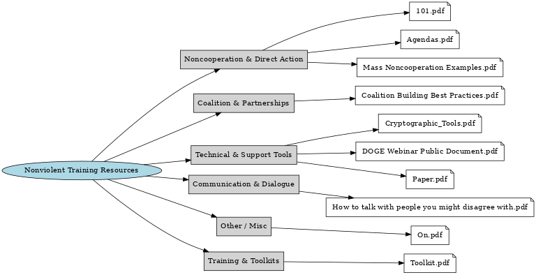

# Strategic Nonviolent Training Resources

An **interactive catalog** of manuals, toolkits, training guides, and reference documents to support civil resistance and movement building.  

This site is built from curated references archived in the [OSF project](https://osf.io/hu5w6/).  
It provides a modern, searchable gallery interface where resources are grouped into categories and linked directly to their OSF source.

🌐 **Live interactive catalog:**  
[https://paulhugel.github.io/strategic-nonviolent-training-resources/](https://paulhugel.github.io/strategic-nonviolent-training-resources/)

📂 **Permanent archival collection:**  
[OSF — Strategic Nonviolent Training Resources](https://osf.io/hu5w6/)

---

## Features
- 📚 Categorized resources: Toolkits, Noncooperation Guides, Coalition Building, Communication, Technical Tools, etc.  
- 🔎 Search and filter resources by keyword or category.  
- 🔗 Direct links to OSF-hosted files (PDFs).  
- 📊 Includes mind map visualization of resource relationships.

---

## Usage
1. Browse resources in the interactive catalog.  
2. Click **Open on OSF** to view the file in the OSF archive.  
3. Use **Download** for offline access.

---

## Technical Notes
- Built as a static HTML + JavaScript app (no backend required).  
- Easily hosted on GitHub Pages, Netlify, or any static file server.  
- Source files:
  - `nonviolent_resources_models_view.html` — interactive catalog
  - `nonviolent_training_resources_mindmap_interactive.svg` — mind map visualization
  - `nonviolent_training_resources_mindmap.png` — static fallback image

---

## Citation
If you use this catalog in research, please cite the OSF project:

> Hugel, P. G. (2025). *Strategic Nonviolent Campaign (2025–2029) to Resist Autocratic Consolidation.* OSF. https://osf.io/hu5w6/

---

## License
Content © Paul Garrett Hugel.  
Catalog code released under the MIT License.
